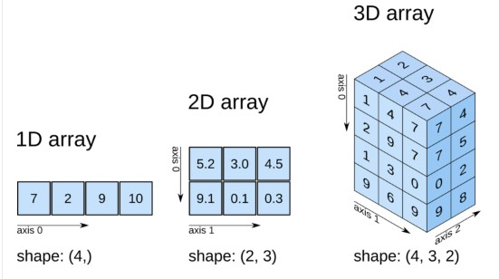
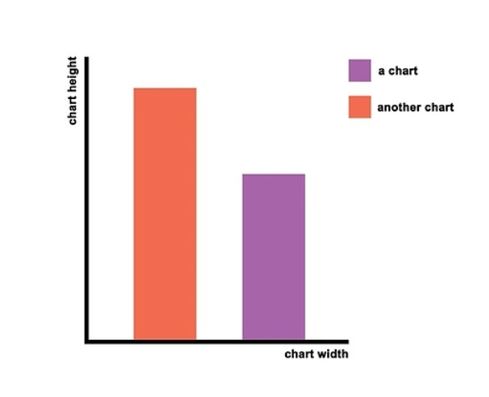
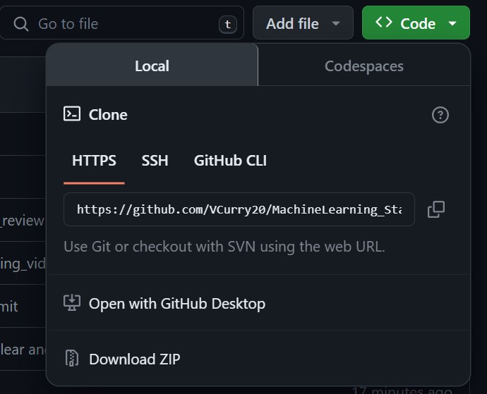

# MachineLearning_Statistics

Machine Learning and Statistics project submission 2023 

Lecturer: Ian McLoughlin

Completed: December 2023

***

## Aims

***

This Repository contains Jupyter Notebooks and files which make up my module submission. These give an overview of Statistics & Machine learning, using Python to explore these concepts.

This project was completed as part of a HDip in Data Analysis for Atlantic Technical University (Formally GMIT).

***

By presenting these files I hope to provide the reader with a greater understanding of statistical concepts, using python to document and test these concepts. 

This repository is made up of data files (CSV files), images, and Jupyter notebooks. The code in the Jupyter Notebooks can be viewed, run and interacted with by a user using with varying degrees of programming ability...or no programming experience! Viewing and interaction with these files can be completed with or without downloading and installing a full Python package.

## Repository Contents

***

 

  -- Tasks (Jupyter Notebook)

  -- Project (Jupyter Notebook)

  -- Data Sets

  -- Video Reviews ((TBC if this is to stay in this repo))

  -- Image Files

  -- gitignore

 

## Python Libraries 

***

Python has a wide range of [Libraries](https://www.mygreatlearning.com/blog/open-source-python-libraries/) which can be imported as needed. Best practice is to run this code from the top of your program. Libraries can be easily added and removed at any time.

Libraries are formed from mostly open source code which has been grouped together by topic or logic (eg.statistics or graphing). This grouping of code eliminates the need for us to write our own code each time and is always being added to and improved.

For programmers new to Python it also offers the ability to complete complex calculations quickly and easily. Source code for these libraries can also be viewed and can offer insights into python programming.

 

 - [NumPy](https://numpy.org/doc/stable/user/absolute_beginners.html)

NumPy is sometimes referred to as numerical Python. NumPy is a library that allows users to store their data in arrays. Arrays are a group of values which are stored together and can be accessed by indexing; this ability to store and index the values allows us to access data, maniplutate it, assess it, we can easily take copies or amend the original. 

    

 - [Pandas](https://pandas.pydata.org/)

 Pandas is a library that sits on and expands on NumPy, Numpy froms a basic numerical array where Pandas moves this data a step further and allows us to form dataframes. Dataframes are spreadsheet like and allow for easier importing of data, manipulation, merging of files, exporting of different file types, handling of missing data fields or null values, and analysis of large files. []

 - [scipy stats](https://docs.scipy.org/doc/scipy-1.7.1/reference/reference/stats.html#:~:text=This%20module%20contains%20a%20large,Monte%20Carlo%20functionality%2C%20and%20more.)

 Scipy Stats offers us a large number of stastical formulas which we can use in our calculations - this removes the need for us to code the formulas independantly. 

 Scipy Stats includes the following "probability distributions, summary and frequency statistics, correlation functions and statistical tests, masked statistics, kernel density estimation, quasi-Monte Carlo functionality". []

    

 - [matplotlib](https://matplotlib.org/)

 Matplotlib is a plotting library for 2D plots of arrays, this works on top of NumPy and allows for quick plotting.
 
 From this library we will import and use [pyplot](https://matplotlib.org/stable/tutorials/pyplot.html) which allows us to use functions similar to those in MATLAB, which is a programming language in its own right, which is used for plotting etc.

 - [Seaborn](https://seaborn.pydata.org/tutorial/introduction.html)

This is another example of a library which operates on top of or extends the functionality of another; "Seaborn is a library for making statistical graphics in Python. It builds on top of matplotlib and integrates closely with pandas data structures." [ same as above seaborn link]

    

 

Please note: there may be other libraries used in this repository but the ones listed are the most fundamental.

 

## Technology Used

***

The following are the programs I used to write, present and store my Python code. For some of the following download and installation are required, however I also provide details how this code can be viewed online both on static HTML renderings and in interactive pages; which allow for limited user input.

I have written this code using Python in Visual Studio Code, which outputs to a Jupyter Notebook. This code is then pushed to an online repository on Github. To view this code and interact with it I have provided the links for NBViewer and Binder. Further you can clone or fork from my Github directly to your device if you would like to run the code from your own Visual Studio Code or Command Line.

 

-- [Python / Anaconda](https://www.anaconda.com/)

-- [Video Studio Code](https://code.visualstudio.com/)

-- [Jupyter](https://jupyter.org/)

-- [git](https://git-scm.com/)

-- [GitHub](https://github.com/)

-- [Binder](https://mybinder.org/)

-- [NBViewer](https://nbviewer.org/)

 

## Python

`print ("Hello World")`

"Python is a high-level, general-purpose programming language." [wiki ]This programming language supports many different programming paradigms and emphasises the importance of readability and simplicity.

Anaconda is "a distribution of Python designed specifically for machine learning and data science" [simpilearn], it comes with many libraries including those mentioned preinstalled.

You can download Anaconda [here](https://www.anaconda.com/download), with Mac, Windows and Linux versions available. Click on the download button, complete the download to your device.

Please note the installation guides for each operating System are [here](https://docs.anaconda.com/free/anaconda/install/)

Once you have installed Anaconda you can launch the [Navigator](https://docs.anaconda.com/free/anaconda/getting-started/#) which provides a GUI to help you launch Visual Studio Code or Jupyter.

Alternatively you can access Anaconda using its inbuilt command line or the Command Line on your device.

I have used a text Editor; Visual Studio Code. This is an additional program which allows us to interact with Anaconda, this offers an extra layer of abstraction - a text editor provides a more user friendly interface with which to interact with Anaconda.

## Visual Studio Code

Visual Studio Code or VSCode is a code or text editor which allows the user to program in a variety of different languages, it offers an interface which you can use to write, amend and run code. Visual studio code has a library of additonal extensions that can be added which offer additional functionality, and offers easy code indentation and error handling.

You can download this software for free [here](https://code.visualstudio.com/?wt.mc_id=DX_841432). Again there are versions available for Windows (it is actually also owned by Microsoft), Mac or Linux.

For a step by Step guide on installation and the basics please review this [page](https://www.codecademy.com/article/visual-studio-code).

From VSCode I have "pushed" my code to Github, which is again owned by Microsoft and offers a platform to store code, collaborate and view code from programmers all over the world.

## Jupyter Notebook

Jupyter Notesbooks offer the programmer the ability to story tell; here you have a page with code boxes - these boxs can hold programming code or markdown (text code), the ability to have both of these running similtiously on a page offer the chance to build a narrative. 

They can be used for more elaborate note taking, where code and text are grouped together - you can see examples of these in my Video Reviews file; or they can also be used to present. By forming a narative of both code and text the author can provide the reader with greater insight, the audience viewing the notebooks can also be collborators with Jupyer offering more ways to work together and share ideas.

Jupyter supports programming code, Markdown and Graphing. To get further insight into these processes please review this [page](https://www.datacamp.com/tutorial/tutorial-jupyter-notebook).

Currently Jupyter offers Jupyter Notebooks, Jupyter Labs and also Jupyter Lite (still in testing).

## git
How do many programmers work together, sharing and updating code simultaneously, and how do you keep track of the many versions of this code? The answer to this is Git.

Git was created and named for Linus Torvalds [wiki]. Git allows for code to be stored on your own device but more importantly centrally so that multiple progammers can share code but also work simultaneously, these changes can be tracked and users have version control. 

You can download git directly and this open source system will allow [you](https://www.simplilearn.com/tutorials/git-tutorial/what-is-git#:~:text=Git%20is%20a%20DevOps%20tool,together%20on%20non%2Dlinear%20development.) to push your own code to code repositories such as github.

    

## Github

Once you have installed git you can then push your code to online repositories, I have used Github but there are alternative versions, "including SourceForge, Bitbucket and GitLab" [gitwiki]

These sites allow for code to be shown in a static form - and allow for users to post various code forms - Python, C, HTML, or Jupyter Notebooks.

This code can be made pivate or public and can be copied or cloned down to individual computers - allowing for the sharing of code. Also Github allows for user to share repositories and work together on projects.

Github is a further continuation of the open source ethos, it allows for users to share information and this infomation is freely available. Users post how-to-guides, programming updates, projects and programs which are all available for other users to review.

## NBViewer

The first way in which we can view this Respository is by using NBViewer. "nbviewer is a web application that lets you enter the URL of a Jupyter Notebook file, renders that notebook as a static HTML web page, and gives you a stable link to that page which you can share with others. nbviewer also supports browsing collections of notebooks (e.g., in a GitHub repository) and rendering notebooks in other formats (e.g., slides, scripts). []

> Project Link:

> Tasks Jupyter Notebook Link:

> Project Jupyter Notebook Link:

## Binder

Binder is a step further than nbviewer, where nbviewer allows for users to share a static jupyter notebook binder will allow for users to run the code - without changing the original file.

The link will op
Here you can interact with my Jupyter notebook, you can change and run the code to see how your interactions change the outcomes.

Click on the binder link below, this will open on your browser. Upon opening you will see a list of files on the left and a main page to your right. It will include all the files in my GitHub repository. The Jupyier notebooks end with  .ipynb.

Choose one of these files to open; it will appear in the right hand panel and from here you can interact with the code.

Click on each set of code to change - hold shift and enter to run the code.

Jupyter notesbooks run from top to bottom, for this reason you can change things lower down, even copying and changing fsquares of code; delete / undo these changes and rerun the full page to undo the changes. 

Repository Binder:

)

***

## How to interact with Repository

The final option available for you to interact with my repository is to either fork or clone my repository to your own machine.

This allows you to take your own copy and to use the code. For differences between these practices please review the [here](https://www.educative.io/answers/what-is-the-difference-between-forking-and-cloning-in-git).

To Clone my Repository:

1. Open the Repository [Location](https://github.com/VCurry20/MachineLearning_Statistics)

2. At the top of each Repository there is a code dropdown menu. From here you can choose the HTTP, the SSH or the Git CLI.

In this case you will use the HTTPS.

    

3. Take a copy of the HTTPS for the repository.

4. Open Git Bash 

5. Changing the opening directory to the location you would like to save a copy of the repository. Type Git Clone and the URL 

              git clone https://github.com/YOUR-USERNAME/YOUR-REPOSITORY

There will now be a copy of the repository saved to your device, using Visual Studio code you can now run, view and change this code.

****

## Bibliography

[]

[]

[]
